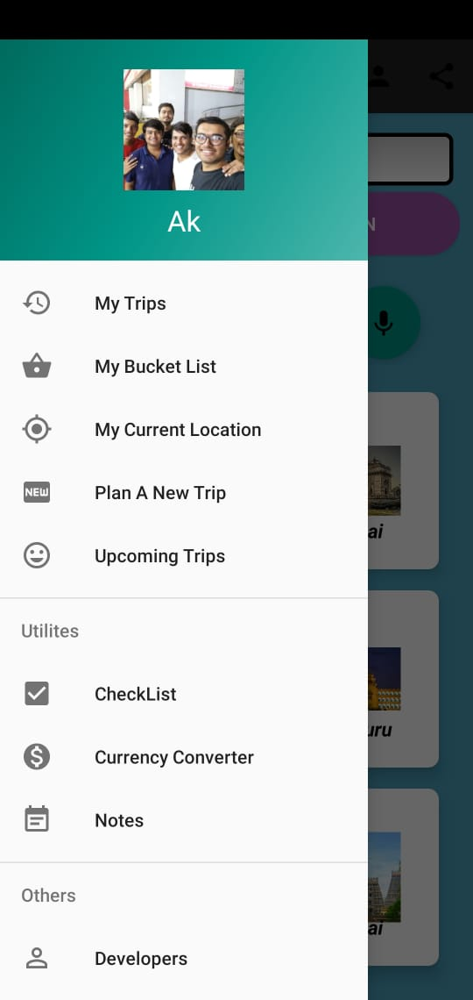
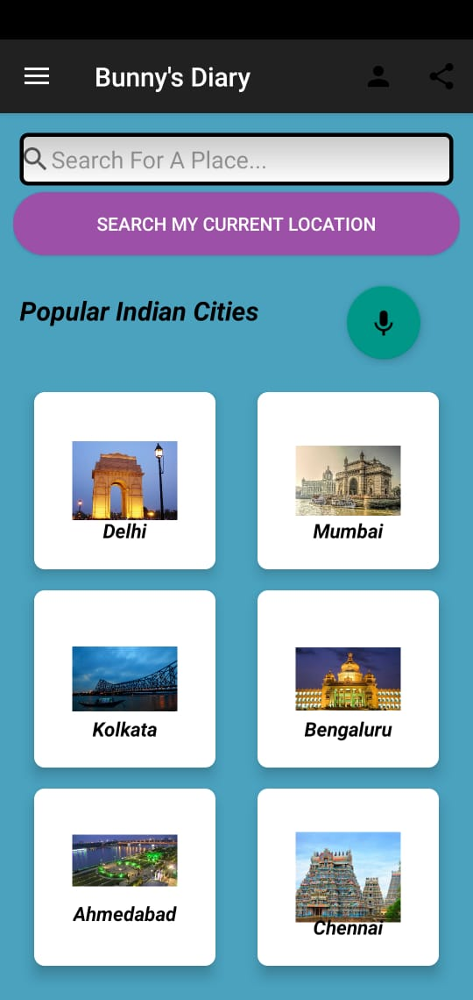
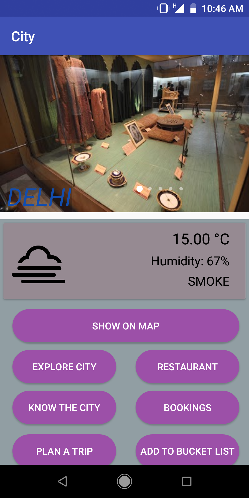
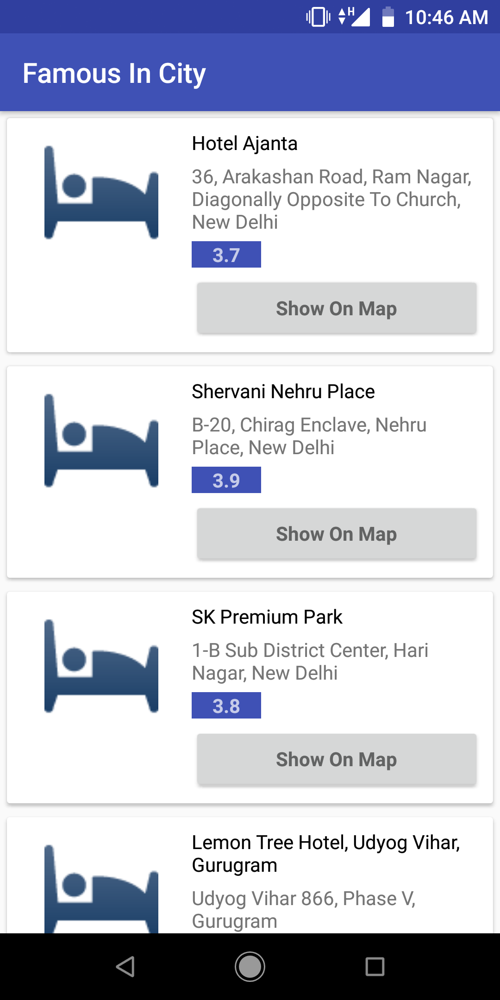
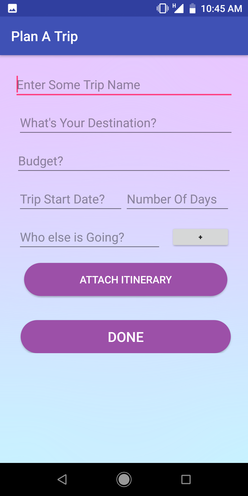

# BunnysDiary
A travel assistant app for planning and managing vacations, holiday tours, trips. Using this app one can find 
weather conditions, famous tourist places, facts, organizing trips, showing famous tourist spots around current location etc.

  

## Features

1.The basic Login/Signup features like one can create an account and login. The user can choose a profile picture and change password etc.

  

2. Get all the information of a city by the options given.The user can locate itself and voice search about any city. Few trending cities are shown already when the user enters his/her profile.

  

3. The user can get details of the city and plan a trip accordingly or add to bucket list. Get the current weather details along with the famous images of city and tourist attractions.

  
  

4. The user can plan a trip and attach itinerary and can use utility options which include checklist,currency converter and notes.

  

5. Use maps to locate yourself and find places of interest around. Upcoming trips section contains the upcoming trips and a reminder is provided a date before the trip.
